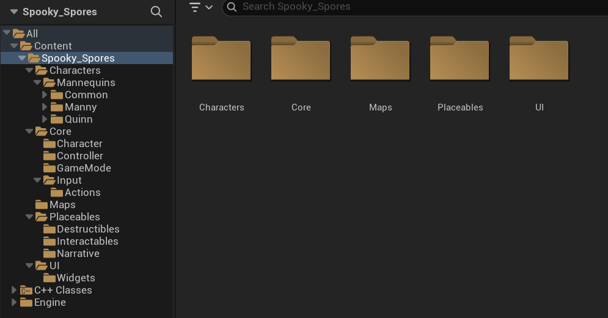
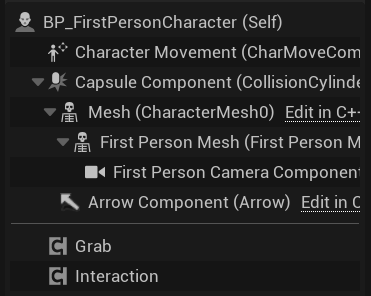
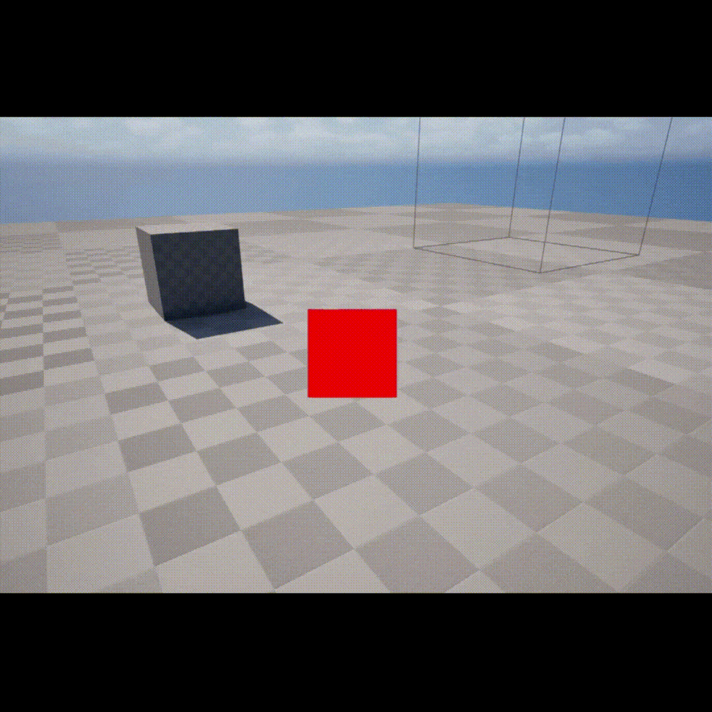
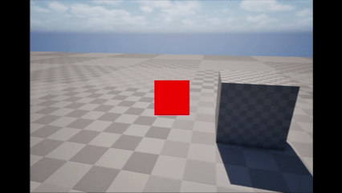
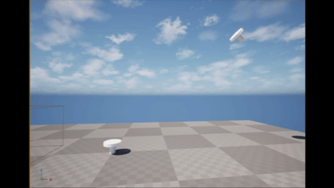
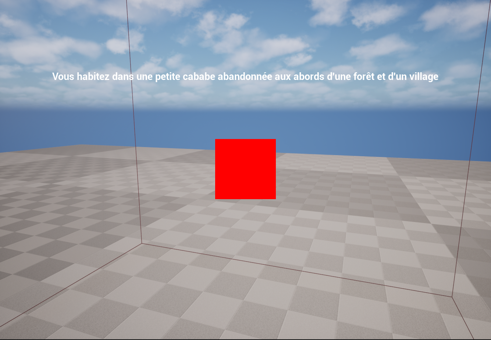
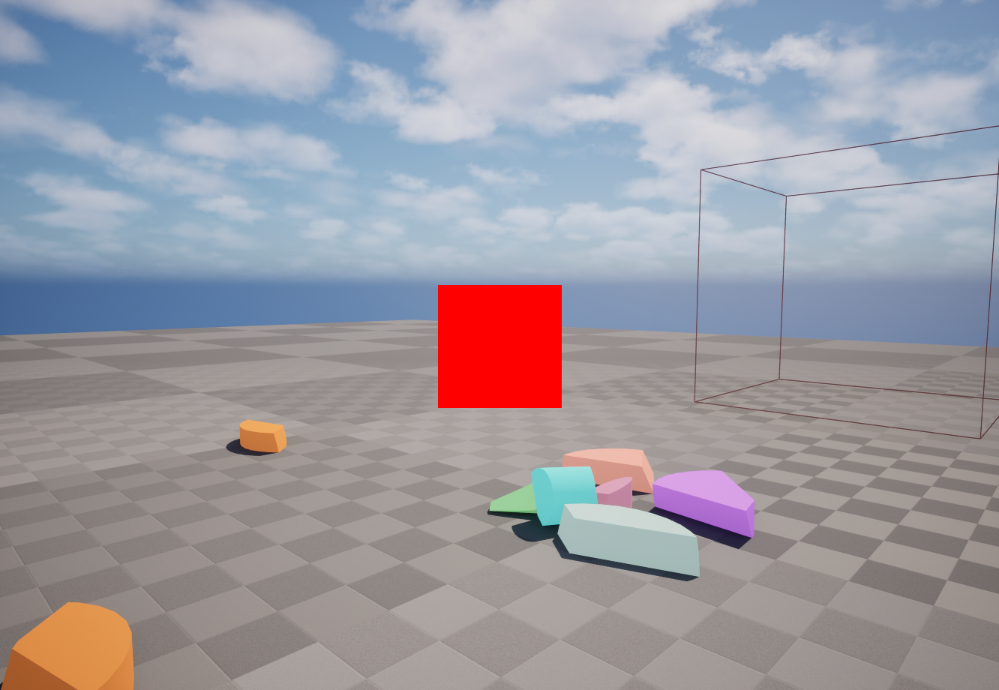

# Documentation technique — Spooky_Spores

**Semaine 1 — Bloc 1 : Unreal Gameplay Architecture & Physics**
**Moteur :** Unreal Engine 5.8.2

---

## 1. Contexte du projet

*Spooky_Spores* est un jeu bac à sable dans lequel le joueur incarne un nécromancien qui vit dans une cabane abandonnée aux abords d'une forêt et d'un village. Interagit avec les objets de son environnement, et expérimente avec des mécaniques de manipulation physique (magie de télékinésie) et de récolte, avant de développer sa base et de défendre son territoire contre les PNJ du village voisin qui viendront attaquer et détruire sa base.

Ce rendu correspond à la **Semaine 1 du Bloc 1**, dont l'objectif est de poser les fondations techniques du projet et de réaliser un prototype : architecture du Gameplay, système d'interaction générique, physique en temps réel (Rigid Body, forces, impulsions), et une première expérimentation avec Chaos.

**Map de test :** `Lvl_FirstPerson`

---

## 2. Architecture globale

Le projet suit une séparation en couches, du joueur jusqu'à l'environnement :

```
Player (ASpooky_SporesCharacter)
   │
   ├── UInteractionComponent   → détecte ce que le joueur regarde
   └── UGrabComponent          → manipule physiquement l'objet détecté
              │
              ▼
Interactive Objects (implémentent IGrabbable et/ou IInteractable)
   │
   ▼
Physics Systems (UPrimitiveComponent + Chaos)
   │
   ▼
Environment (niveau, triggers, décor)
```

Cette séparation garantit qu'aucun système ne connaît les détails d'implémentation d'un autre : le Character ignore comment un objet est saisi, le composant d'interaction ignore comment un objet réagit, et les objets eux-mêmes ignorent qui les manipule.

### Organisation des dossiers

**Code source** (`Source/Spooky_Spores/`) :
```
Interaction/
  Grabbable.h / .cpp        → interface IGrabbable
  Interactable.h / .cpp     → interface IInteractable
  InteractionComponent.h / .cpp
  GrabComponent.h / .cpp
  PhysicsGrabbable.h / .cpp
Narrative/
  StoryTrigger.h / .cpp
CollisionChannels.h          → alias lisibles pour les canaux de collision custom
Core/ (Character, Controller, GameMode avec les fichiers principaux du template)
```

**Content Browser** (`Content/Spooky_Spores/`) :
```
Core/
  Character/, Controller/, GameMode/, Input/Actions/
Placeables/
  Interactables/    → BP_Rock (objets physiques manipulables)
  Narrative/        → BP_StoryTrigger_Entrance
  Destructibles/    → GC_Mushroom (Objets créés avec le fracture mode)
UI/
  Widgets/          → WBP_StoryText
Characters/Mannequins/...
Maps/
```

L'organisation suit la logique du [UE5 Community Style Guide](https://github.com/Allar/ue5-style-guide) : `Core/` contient les briques structurantes à ne pas modifier à la légère, `Placeables/` contient les instances concrètes librement ajustables par niveau.



---

## 3. Classes et composants principaux

| Classe | Type | Rôle |
|---|---|---|
| `IGrabbable` | Interface C++ | Marque un objet comme physiquement saisissable ; expose son composant physique |
| `IInteractable` | Interface C++ | Marque un objet comme réagissant à une interaction générique (non physique) |
| `UInteractionComponent` | Actor Component | Détecte ce que le joueur regarde (trace), distingue Grabbable/Interactable par portée |
| `UGrabComponent` | Actor Component | Gère le grab, le maintien, le lancer via `UPhysicsHandleComponent` |
| `APhysicsGrabbable` | Actor | Objet physique concret implémentant `IGrabbable` (ex. `BP_Rock`) |
| `AStoryTrigger` | Actor | Zone de déclenchement narratif générique (`UBoxComponent` + event Blueprint) |
| `ASpooky_SporesCharacter` | Character | Orchestre les composants ci-dessus, gère les inputs |



---

## 4. Le système d'interaction

Deux interfaces séparées, chacune avec une seule responsabilité (principe SOLID de ségrégation des interfaces) :

- **`IGrabbable`** — une seule méthode, `GetGrabbableComponent()`, qui renvoie le `UPrimitiveComponent` à manipuler physiquement (ou `nullptr` par défaut si l'objet n'est pas réellement saisissable).
- **`IInteractable`** — une seule méthode, `OnInteract(AActor* Instigator)`, pour un comportement générique déclenché sans manipulation physique (ex. un futur établi, une ressource à récolter).

Un objet peut implémenter l'une, l'autre, ou les deux, sans jamais forcer les autres objets à connaître un comportement qui ne les concerne pas.

`UInteractionComponent` effectue un **unique** trace par frame (`LineTraceSingleByObjectType` sur le canal custom `Interactable`), depuis le point de vue réel de la caméra (voir section 6). Il calcule la distance réelle à la cible touchée et expose deux fonctions :

- `IsGrabbableTarget(OutComponent)` → vrai si la cible implémente `IGrabbable` **et** est à portée de `GrabRange` (400 unités)
- `IsInteractableTarget()` → vrai si la cible implémente `IInteractable` **et** est à portée de `InteractRange` (200 unités)

**Choix technique :** une seule trace, à la plus grande des deux portées, plutôt que deux traces séparées, évite la duplication de la logique physique (DRY) pour un coût CPU négligeable.



---

## 5. Grab, Push, Pull, Launch

`UGrabComponent` encapsule un `UPhysicsHandleComponent`, l'outil natif d'Unreal pour maintenir un objet physique en place devant la caméra.

| Verbe du CDC | Implémentation |
|---|---|
| **Pull** | `Grab()` — attrape l'objet détecté et le maintient à la distance où se trouvait le joueur lors du grab et devant la caméra à chaque frame |
| *(reposer)* | `Release()` — relâche la contrainte physique |
| **Launch** | `Launch()` — applique une impulsion (`LaunchImpulseStrength` = 1000, en mode vélocité pour un comportement cohérent quelle que soit la masse) dans la direction du regard, puis relâche |

**Choix technique — Push transformé en Release :** plutôt que d'implémenter une quatrième action séparée, Push a été transformé en un Release : relacher l'objet permet de s'en séparer sans forcément le repousser (Launch étant déjà utilisé pour cela).

**Choix technique — vélocité conservée au relâchement :** `Release()` ne neutralise pas la vélocité de l'objet au moment où il est lâché. Ce comportement est volontaire : il traduit fidèlement l'inertie du mouvement de caméra au moment du relâchement (cohérent avec l'idée d'un objet manipulé par télékinésie), et reste distinct du mécanisme `Launch()` qui, lui, applique une force contrôlée et réglable.

Une seule touche contextuelle (`E` / `DoInteractAction`) arbitre entre reposer, saisir, et interagir, selon l'état courant :
1. Si un objet est déjà tenu → le reposer.
2. Sinon si la cible est grabbable → la saisir.
3. Sinon si la cible est interactable → déclencher l'interaction générique.



---

## 6. Systèmes physiques

- **Canal de collision custom `Interactable`** (`Project Settings > Collision`), aliasé en C++ via `CollisionChannels.h` (`COLLISION_INTERACTABLE`) pour éviter de coder en dur le numéro de `ECC_GameTraceChannelN` dans plusieurs fichiers.
- **Profil de collision `PhysicsInteractable`** appliqué aux objets physiques, avec `Collision Enabled: Query and Physics` (nécessaire pour que le trace et la simulation physique fonctionnent tous les deux).
- **Masse** : non codée en dur, laissée au calcul automatique de Chaos à partir du volume/densité du mesh, ajustable par Blueprint enfant si besoin.
- **Correction de point de vue** : `ASpooky_SporesCharacter` override `GetActorEyesViewPoint()` pour renvoyer la position/rotation réelle de `FirstPersonCameraComponent`, plutôt que le calcul par défaut (`GetActorLocation() + BaseEyeHeight`) qui ne correspond pas à une caméra attachée à un socket avec un offset custom. Tous les systèmes de trace (interaction, grab) s'appuient sur cette source unique et correcte.

---

## 7. Expérimentation Chaos

Un objet décoratif (**`GC_Mushroom`**, un champignon composé de deux primitives fusionnées) a été converti en Geometry Collection via la Fracture Mode (pattern Uniform Voronoi).

- **Damage Threshold** (par niveau de la hiérarchie de fracture) : `5000 / 500 / 50`, abaissé par rapport aux valeurs par défaut (calibrées pour de gros objets destructibles) pour correspondre à des forces d'impact réalistes.
- **Enable Damage From Collision** activé, condition nécessaire pour que les impacts physiques génèrent une contrainte de casse.

Le champignon se fracture aussi bien sous l'effet de la gravité (chute) que d'un impact avec un objet lancé via `UGrabComponent::Launch()`, démontrant l'interaction entre deux systèmes développés cette semaine.



---

## 8. Système narratif (mécanique additionnelle)

`AStoryTrigger` (C++) : une `UBoxComponent` en zone de trigger (profil `Trigger`, pas de simulation physique), une propriété `StoryText` (`FText`) éditable par instance, une garde `bTriggerOnce` pour éviter un redéclenchement en boucle, et un event `BlueprintImplementableEvent OnStoryTriggered()` laissant le comportement concret au Blueprint enfant.

`BP_StoryTrigger_Entrance` (instance qui sera placée à l'entrée de la cabane) déclenche l'affichage d'un widget générique `WBP_StoryText` (une fonction `ShowText(Message)`, implémentée comme Custom Event plutôt que Function, car elle utilise un `Delay`, un nœud latent non autorisé dans les Functions Blueprint).

Bien que non strictement exigé par le CDC de cette semaine, ce système illustre la même architecture générique/réutilisable (base C++, instances Blueprint) et prépare le travail d'*environmental storytelling* prévu au Bloc 3.



---

## 9. Outils de debug

- **Trace de détection** (`DrawDebugLine`) : ligne non persistante suivant la caméra, verte si une cible est détectée, rouge sinon, permet de vérifier en temps réel le fonctionnement du système d'interaction.
- **Visualisation du volume de trigger** : le `UBoxComponent` de `AStoryTrigger` reste visible en wireframe dans l'éditeur pour vérifier son placement et ses dimensions.
- **Bone colors de la Fracture Mode** : pendant le développement, chaque morceau du Geometry Collection est affiché dans une couleur distincte (`Show Bone Colors`) pour vérifier visuellement le résultat de la fracture avant de désactiver cet affichage de debug pour le rendu final.



---

## 10. Limitations connues et pistes d'amélioration

- Le mécanisme **Push** n'existe pas comme action indépendante, actuellement transformé en Release, comme expliqué en section 5.
- Aucune sauvegarde persistante : `bHasTriggered` sur `AStoryTrigger` et l'état des objets physiques sont réinitialisés à chaque lancement, un système de sauvegarde est identifié comme travail futur nécessaire. (Cf. TODO.md)
- Le nombre de morceaux du Geometry Collection est actuellement minimal, pourrait être enrichi visuellement dans une suite du projet.

---

# Statement d'intention IA

### Outils utilisés
Pour ce projet, je compte utiliser Claude, il s'agit à mon goût d'une IA assez performante dans le cadre de la création de jeu vidéo et me permettant de créer un "projet" pour la création de ce sandbox, incluant des intégrations de fichiers pour lui donner le contexte et elle a aussi une mémoire de la conversation réalisée.

### Où l'IA a été utilisée
Actuellement, j'ai utilisé l'IA comme "assistant". Je lui ai donné les infos de mon projet et je lui ai demandé de m'accompagner dans la création du projet (Pour les fichiers cpp ou documentation).

### Pourquoi
J'utilise l'IA dans mon projet parce que de nos jours, il s'agit en quelque sorte de notre outil de travail. Je m'aide donc de la performance de cet outil pour apprendre, corriger mes erreurs, m'aider à m'améliorer dans la manière d'intégrer des mécaniques ou des idées de mon projet,...

### Comment
Pour ne pas simplement donner le projet à l'IA et lui dire "tu peux tout me coder pour le finir en une semaine ?", je m'aide de l'IA. Pour faire simple, j'explique à l'IA mes intentions, les idées que j'ai pour intégrer tout et ensuite je converse avec elle pour savoir si c'est une bonne manière de faire, si ce ne serait pas mieux d'une autre façon,... Une fois que cela est fait, je réfléchis à comment créer les fichiers cpp, je commence à les remplir et lorsque je commence à avoir du mal à les réaliser, je demande à l'IA de me donner un petit coup de main en m'expliquant toujours ce qu'elle fait ou ce que je ne comprends pas pour avoir toujours la possibilité d'expliquer mon code ou tout simplement, me permettre de le comprendre pour m'en servir à nouveau plus tard.

### Bénéfices obtenus
L'IA me permet d'aller plus vite dans mes démarches, de ne pas écrire quelque chose puis finalement ensuite me dire qu'il y a mieux à faire et tout recommencer. Je préfère réfléchir totalement dans un premier temps à la meilleure manière de procéder puis la réaliser.

### Limites rencontrées
Dans l'ensemble, Claude ne s'est très peu trompé car je lui ai précisément dit la version du moteur que j'utilisais, d'aller régulièrement regarder la documentation d'UE et également de ne jamais me dire quelque chose si il n'est pas sûr de lui pour ne pas me tromper ou écrire de fausses choses.
