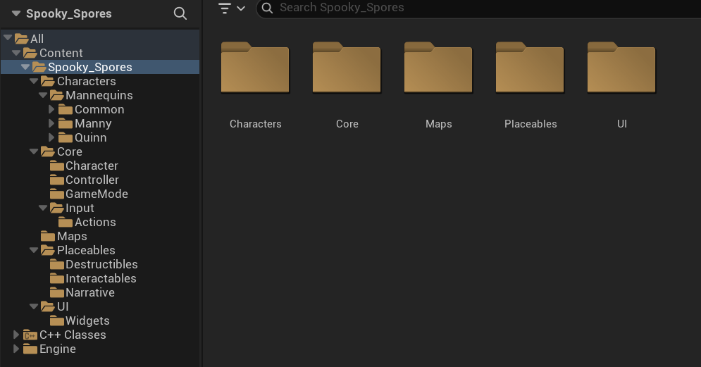
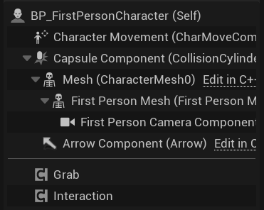
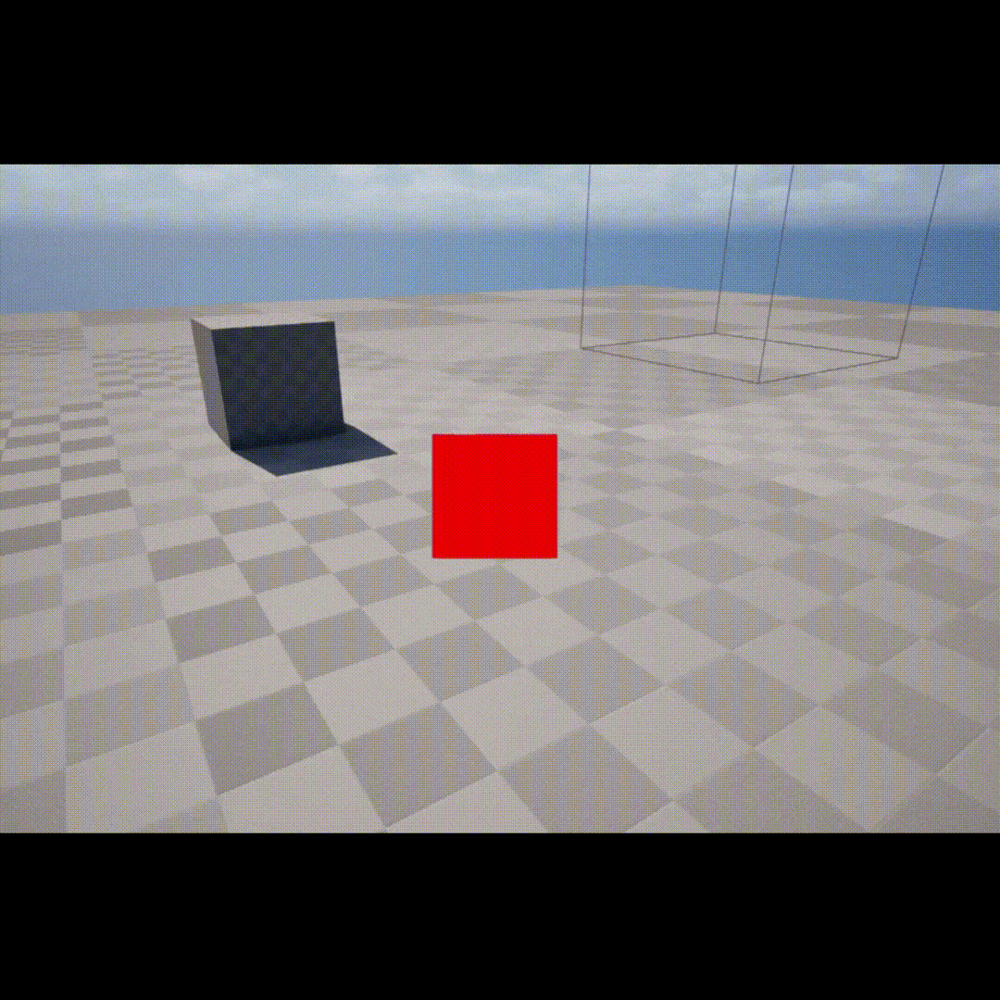
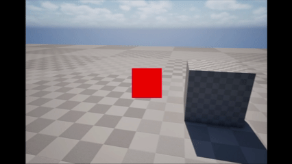
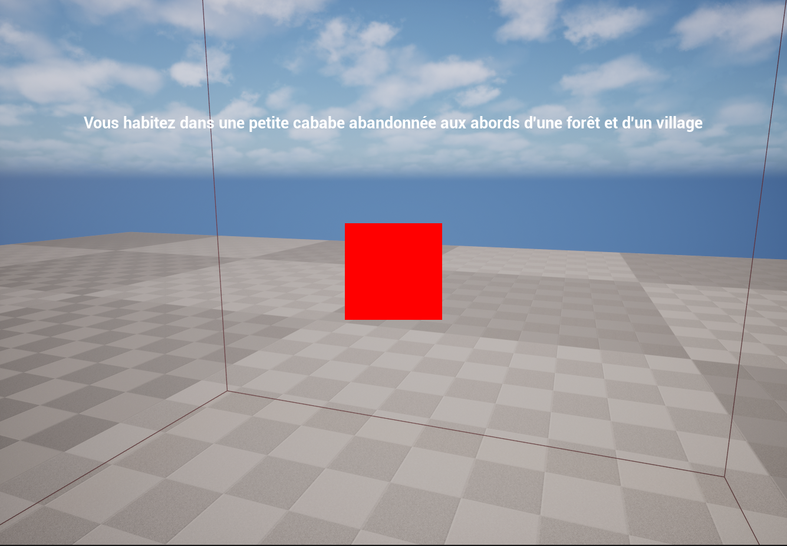
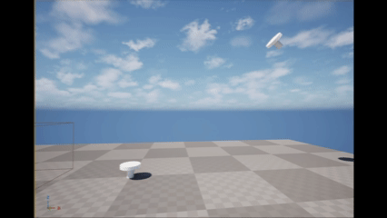
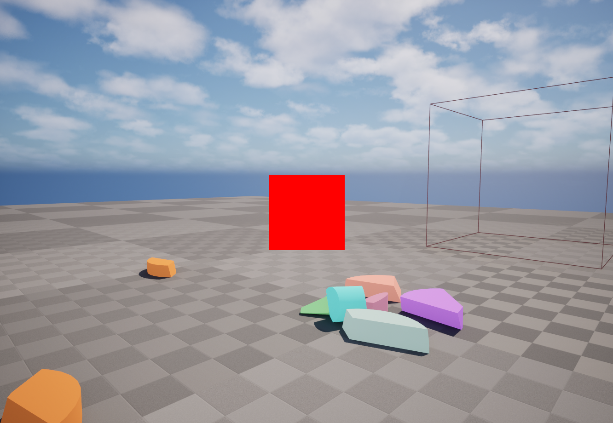

# Documentation technique — Spooky_Spores

**Moteur :** Unreal Engine 5.8.3

Ce document décrit l'architecture **actuelle** du projet, organisée par système plutôt que par semaine de développement. Pour l'historique des rendus notés (avec leur statement d'intention IA respectif), voir le dossier [`Rendus/`](Rendus/).

---

## 1. Contexte du projet

*Spooky_Spores* est un jeu bac à sable dans lequel le joueur incarne un nécromancien qui vit dans une cabane abandonnée aux abords d'une forêt et d'un village. Il interagit avec les objets de son environnement, expérimente avec des mécaniques de manipulation physique (magie de télékinésie) et de récolte, avant de développer sa base et de défendre son territoire contre les PNJ du village voisin.

3C complet (contrôles, caméra, personnage) : voir le `README.md`.

**Map de test :** `Lvl_FirstPerson`

---

## 2. Architecture globale

Le projet suit une séparation en couches, du joueur jusqu'à l'environnement :

```
Player (ASpooky_SporesCharacter)
   │
   ├── UInteractionComponent     → détecte ce que le joueur regarde
   ├── UGrabComponent            → manipule physiquement l'objet détecté
   ├── UResourceCounterComponent → comptabilise les ressources récoltées
   └── UStaminaComponent         → gère la ressource d'endurance (sprint)
              │
              ▼
Interactive Objects (implémentent IGrabbable et/ou IInteractable)
   │
   ▼
Physics Systems (UPrimitiveComponent + Chaos)
   │
   ▼
Environment (niveau, triggers, décor)
```

Cette séparation garantit qu'aucun système ne connaît les détails d'implémentation d'un autre : le Character ignore comment un objet est saisi, un composant ignore l'existence des autres, et les objets eux-mêmes ignorent qui les manipule. Quand deux composants doivent se coordonner (ex. relâcher un objet tenu avant d'interagir), c'est le Character qui arbitre — jamais un composant qui appelle directement un autre.

### Organisation des dossiers

**Code source** (`Source/Spooky_Spores/`), rangé par domaine fonctionnel :
```
CollisionChannels.h          → alias lisibles pour les canaux de collision custom
Core/
  Character/    Spooky_SporesCharacter, Spooky_SporesCameraManager
  Controller/   Spooky_SporesPlayerController
  GameMode/     Spooky_SporesGameMode
Interaction/    Grabbable, Interactable, InteractionComponent, GrabComponent, PhysicsGrabbable
Narrative/      StoryTrigger
Resources/      ResourceTypes, ResourceCounterComponent, ResourceDrop, HarvestableResource
Movement/       StaminaComponent
```
Un nouveau domaine fonctionnel = un nouveau dossier.

**Content Browser** (`Content/Spooky_Spores/`) :
```
Core/          Character/, Controller/, GameMode/, Input/Actions/
Placeables/    Interactables/ (BP_Rock), Narrative/ (BP_StoryTrigger_Entrance),
               Destructibles/ (GC_Mushroom),
               Resources/ (BP_Drop_Seed, BP_Drop_Stone, BP_Drop_Wood,
                           BP_Harvestable_Plant, BP_Harvestable_Stone, BP_Harvestable_Wood)
UI/Widgets/    WBP_StoryText, WBP_ResourceEntry, WBP_ResourceCounter, WBP_StaminaBar
Characters/Mannequins/...
Maps/
```

L'organisation suit la logique du [UE5 Community Style Guide](https://github.com/Allar/ue5-style-guide) : `Core/` contient les briques structurantes à ne pas modifier à la légère, `Placeables/` contient les instances concrètes librement ajustables par niveau.



---

## 3. Interaction et manipulation physique

### Classes et composants principaux

| Classe | Type | Rôle |
|---|---|---|
| `IGrabbable` | Interface C++ | Marque un objet comme physiquement saisissable ; expose son composant physique |
| `IInteractable` | Interface C++ | Marque un objet comme réagissant à une interaction générique (non physique) |
| `UInteractionComponent` | Actor Component | Détecte ce que le joueur regarde (trace), distingue Grabbable/Interactable par portée |
| `UGrabComponent` | Actor Component | Gère le grab, le maintien, le lancer via `UPhysicsHandleComponent` |
| `APhysicsGrabbable` | Actor | Objet physique concret implémentant `IGrabbable` (ex. `BP_Rock`) |
| `ASpooky_SporesCharacter` | Character | Orchestre tous les composants, gère les inputs |



### Détection

Deux interfaces séparées, chacune avec une seule responsabilité (principe SOLID de ségrégation des interfaces) :

- **`IGrabbable`** — une seule méthode, `GetGrabbableComponent()`, qui renvoie le `UPrimitiveComponent` à manipuler physiquement (ou `nullptr` par défaut si l'objet n'est pas réellement saisissable).
- **`IInteractable`** — une seule méthode, `OnInteract(AActor* Instigator)`, pour un comportement générique déclenché sans manipulation physique (établi, ressource à récolter...).

Un objet peut implémenter l'une, l'autre, ou les deux, sans jamais forcer les autres objets à connaître un comportement qui ne les concerne pas.

`UInteractionComponent` effectue un **unique** trace par frame (`LineTraceSingleByObjectType` sur le canal custom `Interactable`), depuis le point de vue réel de la caméra (voir section 5). Il calcule la distance réelle à la cible touchée et expose deux fonctions :

- `IsGrabbableTarget(OutComponent)` → vrai si la cible implémente `IGrabbable` **et** est à portée de `GrabRange` (400 unités)
- `IsInteractableTarget()` → vrai si la cible implémente `IInteractable` **et** est à portée de `InteractRange` (200 unités)

**Choix technique :** une seule trace, à la plus grande des deux portées, plutôt que deux traces séparées, évite la duplication de la logique physique (DRY) pour un coût CPU négligeable.



### Grab, Push, Pull, Launch

`UGrabComponent` encapsule un `UPhysicsHandleComponent`, l'outil natif d'Unreal pour maintenir un objet physique en place devant la caméra.

| Verbe du CDC | Implémentation |
|---|---|
| **Pull** | `Grab()` — attrape l'objet détecté et le maintient devant la caméra à chaque frame |
| *(reposer)* | `Release()` — relâche la contrainte physique |
| **Launch** | `Launch()` — applique une impulsion (`LaunchImpulseStrength` = 1000, en mode vélocité pour un comportement cohérent quelle que soit la masse) dans la direction du regard, puis relâche |

**Choix technique — Push transformé en Release :** plutôt qu'une quatrième action séparée, Push a été fusionné dans Release : relâcher l'objet permet de s'en séparer sans forcément le repousser (Launch étant déjà utilisé pour cela).

**Choix technique — vélocité conservée au relâchement :** `Release()` ne neutralise pas la vélocité de l'objet au moment où il est lâché. Ce comportement est volontaire : il traduit fidèlement l'inertie du mouvement de caméra au moment du relâchement (cohérent avec l'idée d'un objet manipulé par télékinésie), et reste distinct du mécanisme `Launch()` qui, lui, applique une force contrôlée et réglable.

Une seule touche contextuelle (`E` / `DoInteractAction`) arbitre entre reposer, saisir, et interagir, selon l'état courant :
1. Si un objet est déjà tenu → le reposer.
2. Sinon si la cible est grabbable → la saisir.
3. Sinon si la cible est interactable → déclencher l'interaction générique.



### Canaux et profils de collision

- **Canal de collision custom `Interactable`** (`Project Settings > Collision`), aliasé en C++ via `CollisionChannels.h` (`COLLISION_INTERACTABLE`) pour éviter de coder en dur le numéro de `ECC_GameTraceChannelN` dans plusieurs fichiers.
- **Profil de collision `PhysicsInteractable`** appliqué aux objets physiques, avec `Collision Enabled: Query and Physics` (nécessaire pour que le trace et la simulation physique fonctionnent tous les deux).
- **Masse** : non codée en dur, laissée au calcul automatique de Chaos à partir du volume/densité du mesh, ajustable par Blueprint enfant si besoin.
- **Correction de point de vue** : `ASpooky_SporesCharacter` override `GetActorEyesViewPoint()` pour renvoyer la position/rotation réelle de `FirstPersonCameraComponent`, plutôt que le calcul par défaut (`GetActorLocation() + BaseEyeHeight`) qui ne correspond pas à une caméra attachée à un socket avec un offset custom. Tous les systèmes de trace (interaction, grab) s'appuient sur cette source unique et correcte.

---

## 4. Récolte de ressources

`EResourceType` (`Resources/ResourceTypes.h`) énumère les types de ressources (`Seed`, `Wood`, `Stone`).

`UResourceCounterComponent` : `TMap<EResourceType, int32>` tenant le compte par type, fonction `AddResource(Type, Amount)` (récupère l'entrée via `FindOrAdd` **par référence** pour que l'incrémentation soit réellement stockée), `GetResourceCount(Type)`, et un délégué `FOnResourceChanged` (`BlueprintAssignable`) diffusé à chaque ajout — modèle *push*, adapté à une donnée qui ne change que ponctuellement (contraste avec la section 5).

`AHarvestableResource` : nœud récoltable, implémente `IInteractable`. `OnInteract_Implementation` coupe d'abord la collision du nœud, fait apparaître ses drops (un par entrée de `TArray<FResourceDropEntry>`, position aléatoire dans un rayon `DropSpawnRadius`), puis détruit le nœud.

**Choix technique — spawn différé (`SpawnActorDeferred`) :** `SpawnActor` classique exécute `BeginPlay` et les premiers overlaps **avant** de rendre la main à l'appelant. Un drop apparu dans la capsule du joueur était donc ramassé avant que `InitializeDrop(Type, Amount)` n'ait pu lui donner ses vraies données (bug observé en développement : du bois donnait une graine). Le spawn différé (`SpawnActorDeferred` → `InitializeDrop` → `FinishSpawning`) garantit que les données sont posées avant que `BeginPlay` ne s'exécute.

`AResourceDrop` : l'objet ramassable au sol.
- Profil de collision `ResourceDrop`, un canal custom séparé d'`Interactable`, pour que les drops s'ignorent entre eux plutôt que de se bloquer avec des vitesses d'expulsion importantes à l'apparition.
- Au `BeginPlay` : saut initial (`FMath::VRandCone` autour de la verticale, impulsion en mode vélocité), puis délai de ramassage (`PickupDelay`) pendant lequel les overlaps sont ignorés, pour qu'un drop ne se ramasse pas lui-même avant d'avoir fini d'apparaître.
- **Atterrissage** : au premier contact avec une surface dont la normale a `Z >= MinGroundNormalZ` (0.7), la physique est coupée, seule la rotation en yaw est conservée, et la position est corrigée verticalement via les `Bounds` du mesh pour que sa base touche le sol — y compris sur une pente.
- `TryCollect` renvoie un `bool` pour empêcher un double ramassage, et vérifie la présence d'un `UResourceCounterComponent` sur l'acteur qui tente de ramasser (un ennemi est aussi un Pawn, mais n'a pas ce composant).

UI : `WBP_ResourceEntry` (une ressource, filtrée par type via un nœud `Equal (Enum)` — une égalité numérique classique ne peut pas se brancher sur un enum) et `WBP_ResourceCounter` (une entrée par type). Le widget **reçoit** le compteur (`InitializeCounter(Counter)`) plutôt que d'aller le chercher lui-même, pour ne pas dépendre de l'ordre d'initialisation entre le Character et son UI.

---

## 5. Mouvement — Sprint et endurance

`UStaminaComponent` (`Movement/StaminaComponent.h`) modélise la ressource d'endurance, indépendamment de la vitesse de déplacement — le Character reste seul à arbitrer la vitesse, comme il arbitre déjà entre `GrabComponent` et `InteractionComponent`.

- `TryStartSprint()` refuse de démarrer si `CurrentStamina <= 0`.
- `TickComponent` décrémente l'endurance pendant le sprint, et la régénère après un délai sans sprint (`RegenDelay`, 4 s selon le 3C) tant que `CurrentStamina < MaxStamina`.
- Un délégué `FOnSprintStateChanged` (`BlueprintAssignable`) informe le Character de chaque changement d'état de sprint — y compris un arrêt **forcé** par épuisement de l'endurance, pas seulement un relâchement volontaire du joueur.

**Choix technique — un seul point de changement de vitesse :** `DoSprintStart`/`DoSprintStop` du Character se contentent de transmettre l'intention au composant (`TryStartSprint`/`StopSprint`). La vitesse (`MaxWalkSpeed`) n'est modifiée qu'à un seul endroit, `HandleSprintStateChanged`, lié au délégué. Résultat : que le sprint s'arrête volontairement ou par manque d'endurance, la vitesse est remise à jour de la même façon, sans dupliquer la logique.

**Choix technique — push (délégué) pour l'état, pull (tick) pour l'affichage :** le changement d'état de sprint (discret, rare) est diffusé par délégué, comme `OnResourceChanged`. La valeur d'endurance elle-même (continue, change à chaque frame) est en revanche interrogée directement par le widget `WBP_StaminaBar` dans son propre `Event Tick` (`GetStaminaRatio()`), plutôt que diffusée en continu — un délégué broadcasté à chaque frame n'aurait fait que déplacer un tick sans bénéfice réel.

`WBP_StaminaBar` : une `Progress Bar` minimale, sans habillage (même logique que `WBP_ResourceCounter`) — le visuel réel est prévu au Bloc 2.

---

## 6. Plantation et récolte des champs

`AFieldPlot` (`Resources/FieldPlot.h`) : emplacement plantable et **réutilisable**, à l'inverse de `AHarvestableResource` qui se détruit après récolte. Trois états (`EFieldState`) : `Empty` → `Growing` → `Grown`, pilotés uniquement par `OnInteract_Implementation` selon l'état courant — une seule touche contextuelle, comme partout ailleurs dans le projet.

- **Planter** (état `Empty`) : dépense `SeedCost` graines via `UResourceCounterComponent::TrySpendResource` (utilise `Find`, pas `FindOrAdd` — dépenser une ressource jamais possédée doit échouer proprement, pas créer une entrée à 0), puis lance un `SetTimer` unique de `GrowthDuration` secondes. Pas de `Tick` nécessaire pour la pousse elle-même : une échéance simple, pas une valeur continue à faire évoluer (contraste avec `UStaminaComponent`).
- **Récolter** (état `Grown`) : spawn les drops configurés (graines + une nouvelle ressource, `Wheat`), puis repasse à `Empty` — le champ reste en place, replantable à l'infini.

**Choix technique — spawn de drops factorisé** : la boucle de spawn différé, dupliquée au départ entre `AHarvestableResource` et `AFieldPlot`, a été extraite dans une fonction statique partagée, `AResourceDrop::SpawnDrops`. `FResourceDropEntry` a été déplacée de `HarvestableResource.h` vers `ResourceTypes.h` pour éviter un include circulaire. Prête à être réutilisée pour le butin des ennemis (section 12 du `CLAUDE.md`).

**Outil de debug** : une sphère colorée (`DrawDebugSphere`, non persistante, recalculée à chaque tick) au-dessus du champ — gris/rouge/vert selon l'état. Remplacera un vrai matériau au Bloc 2.

---

## 7. Préparation de potions (Chaudron)

`ACauldron` (`Resources/Cauldron.h`) : acteur implémentant `IInteractable`, trois états (`ECauldronState`) pilotés, comme `AFieldPlot`, par un seul point d'entrée, `OnInteract_Implementation`, selon l'état courant.

- **Idle** : vérifie que l'acteur qui interagit possède chaque ressource de `RequiredIngredients` (`TMap<EResourceType, int32>`) en quantité suffisante, **avant** d'en dépenser la moindre — une première boucle ne fait que vérifier, une seconde dépense réellement via `TrySpendResource`. Cette vérification en deux passes évite de consommer une partie de la recette puis d'échouer sur un ingrédient manquant (transaction atomique). Lance ensuite un `FTimerHandle` unique de `BrewDuration` secondes.
- **Brewing** : aucune action : le joueur ne peut rien faire tant que la préparation n'est pas terminée.
- **Ready** : crédite directement `OutputAmount` unités de `OutputPotionType` via `UResourceCounterComponent::AddResource`, puis repasse à `Idle` — le chaudron, comme `AFieldPlot`, reste en place et réutilisable.

**Choix technique — potion créditée directement, sans objet physique au sol** : contrairement aux ressources récoltées (`AHarvestableResource`, `AFieldPlot`), la potion ne fait pas apparaître de `AResourceDrop` à ramasser. Le résultat est crédité instantanément au compteur du joueur. Simplification assumée en l'absence d'un vrai système d'inventaire (repoussé après le Bloc 2, voir `CLAUDE.md` section 12) : fabriquer un pickup physique pour un objet qui finira de toute façon dans un inventaire structuré aurait été du travail jetable.

**Choix technique — progression par temps écoulé, pas par décompte au tick** : `GetBrewProgress()` (`BlueprintPure`) ne décrémente pas une valeur à chaque frame comme `UStaminaComponent`. Elle calcule un ratio à partir de `GetWorld()->GetTimeSeconds() - BrewStartTime`, sur le même principe que la pousse d'un `AFieldPlot` (section 6) : une échéance fixe à surveiller, pas une valeur qui évolue en continu indépendamment de toute interrogation.

`WBP_CauldronProgress` interroge `GetBrewProgress()` dans son propre `Event Tick` (modèle *pull*, comme `WBP_StaminaBar`) pour afficher une barre de progression pendant le Brewing.

**Recette actuelle** : 3 Bois + 1 Pierre + 2 Blé → 1 Potion (`EResourceType::Potion`, ajouté en fin d'énumération pour ne pas décaler les valeurs existantes — voir le piège correspondant section 11 du `CLAUDE.md`).

**Limite assumée** : une seule recette par chaudron (`RequiredIngredients` réglé une fois dans l'éditeur). Une interface de sélection de recette n'a de sens qu'à partir d'au moins deux recettes différentes — reporté dans `TODO.md`.

---

## 8. Système narratif

`AStoryTrigger` (C++) : une `UBoxComponent` en zone de trigger (profil `Trigger`, pas de simulation physique), une propriété `StoryText` (`FText`) éditable par instance, une garde `bTriggerOnce` pour éviter un redéclenchement en boucle, et un event `BlueprintImplementableEvent OnStoryTriggered()` laissant le comportement concret au Blueprint enfant.

`BP_StoryTrigger_Entrance` (placé à l'entrée de la cabane) déclenche l'affichage d'un widget générique `WBP_StoryText` (une fonction `ShowText(Message)`, implémentée comme Custom Event plutôt que Function, car elle utilise un `Delay`, un nœud latent non autorisé dans les Functions Blueprint).

Ce système illustre la même architecture générique/réutilisable (base C++, instances Blueprint) que le reste du projet, et prépare le travail d'*environmental storytelling* prévu au Bloc 3.



---

## 9. Expérimentation Chaos

Un objet décoratif (**`GC_Mushroom`**, un champignon composé de deux primitives fusionnées) a été converti en Geometry Collection via la Fracture Mode (pattern Uniform Voronoi).

- **Damage Threshold** (par niveau de la hiérarchie de fracture) : `5000 / 500 / 50`, abaissé par rapport aux valeurs par défaut (calibrées pour de gros objets destructibles) pour correspondre à des forces d'impact réalistes.
- **Enable Damage From Collision** activé, condition nécessaire pour que les impacts physiques génèrent une contrainte de casse.

Le champignon se fracture aussi bien sous l'effet de la gravité (chute) que d'un impact avec un objet lancé via `UGrabComponent::Launch()`.



---

## 10. Outils de debug

- **Trace de détection** (`DrawDebugLine`) : ligne non persistante suivant la caméra, verte si une cible est détectée, rouge sinon, permet de vérifier en temps réel le fonctionnement du système d'interaction.
- **Visualisation du volume de trigger** : le `UBoxComponent` de `AStoryTrigger` reste visible en wireframe dans l'éditeur pour vérifier son placement et ses dimensions.
- **Bone colors de la Fracture Mode** : pendant le développement, chaque morceau du Geometry Collection est affiché dans une couleur distincte (`Show Bone Colors`) pour vérifier visuellement le résultat de la fracture avant de désactiver cet affichage de debug pour le rendu final.



**Panneau de contrôles** (`WBP_ControlsPanel`) : distinct des outils ci-dessus, pas destiné au développement mais à la consultation en jeu — un texte statique listant les touches actuelles (section 9 ci-dessus), togglé par la touche Entrée (`ASpooky_SporesCharacter::DoToggleControlsPanel` → event Blueprint `OnToggleControlsPanel`, même principe que `AStoryTrigger::OnStoryTriggered` : le C++ déclenche, le Blueprint décide de l'affichage). Pensé pour que les intervenants qui testent le jeu puissent consulter les touches sans dépendre de la documentation externe.

---

## 11. Limitations connues et dette technique

Centralisées dans [`TODO.md`](TODO.md), pour éviter une double liste qui diverge avec le temps.
